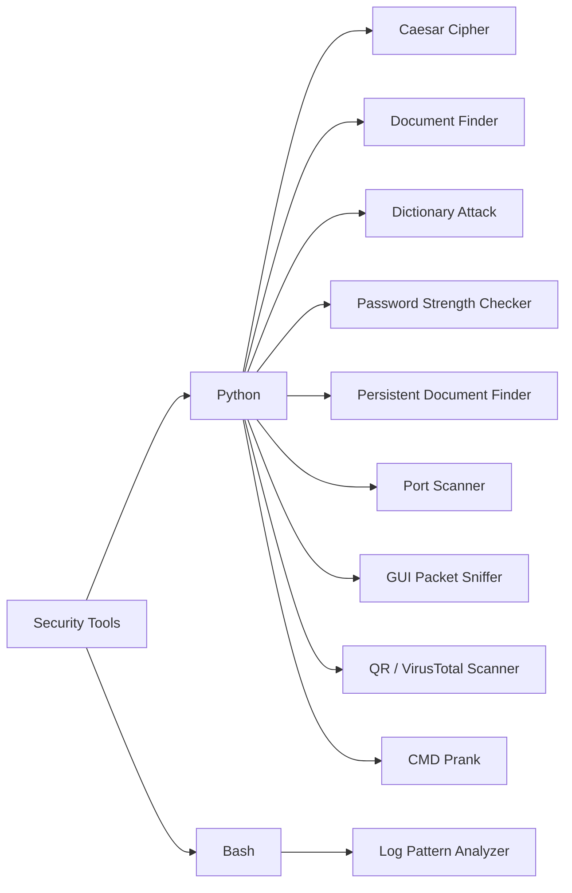
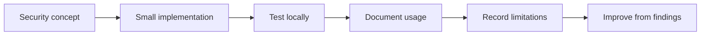

# Security Tools

A collection of small, practical security utilities built to strengthen Python, Bash, networking, and security-analysis skills.

The repository separates **working security tools** from learning exercises. Each tool is intentionally kept readable so the implementation, limitations, and security concepts can be understood and explained.

> **Authorized-use notice:** Tools that interact with networks, credentials, packet captures, or external security services should only be used on systems, accounts, and data you own or are explicitly authorized to test.

---

## Repository Map



## Tools

| Tool | Language | What it demonstrates |
|---|---|---|
| [Caesar Cipher](python/1-caesar-cipher/) | Python | Classical encryption, decryption, and brute-force analysis |
| [Document Finder](python/2-document-finder/) | Python | Filesystem enumeration and sensitive-data discovery |
| [Dictionary Attack](python/3-dictionary-attack/) | Python | Local credential-testing concepts and password weakness |
| [Password Strength Checker](python/4-password-strength-checker/) | Python | Rule-based password strength checks and their limitations |
| [Persistent Document Finder](python/5-persistent-document-finder/) | Python | OS-level persistence mechanisms (MITRE ATT&CK TA0003) combined with data discovery |
| [Port Scanner](python/6-port-scanner/) | Python | TCP reconnaissance, port ranges, and common service identification |
| [GUI Packet Sniffer](python/7-gui-packet-sniffer/) | Python / Scapy | Live packet capture, protocol filtering, and PCAP export |
| [QR / VirusTotal Scanner](python/8-qr-virustotal-scanner/) | Python | QR decoding and reputation checking of extracted URLs |
| [CMD Prank](python/9-cmd-prank/) | Python | Trojan-style hidden behavior triggered by innocuous-looking program logic |
| [Log Pattern Analyzer](bash/log-pattern-analyzer/) | Bash | Pattern-based log review and frequency analysis |

## How I Approach These Tools

The goal is not to build large frameworks. The goal is to build **small utilities that solve a clear problem and make the underlying security concept visible**.



This makes the repository useful both as a learning record and as a portfolio of practical work.

## Running a Tool

Each tool has its own README with requirements and usage instructions. Start from the relevant directory rather than relying on commands copied from another tool.

For example:

```bash
cd python/6-port-scanner
python port-scanner.py --help
```

Most Python tools use the standard library. Tools with external dependencies document them in their individual README files.

## Security & Limitations

These projects are educational and practical demonstrations, not replacements for mature security products. Network scanners, packet capture tools, credential-testing demonstrations, and reputation lookups can produce incomplete or misleading results depending on the environment and data available.

Individual READMEs document tool-specific limitations where they matter.

## Repository Structure

```text
security-tools/
├── python/
│   ├── 1-caesar-cipher/
│   ├── 2-document-finder/
│   ├── 3-dictionary-attack/
│   ├── 4-password-strength-checker/
│   ├── 5-persistent-document-finder/
│   ├── 6-port-scanner/
│   ├── 7-gui-packet-sniffer/
│   ├── 8-qr-virustotal-scanner/
│   └── 9-cmd-prank/
├── bash/
│   └── log-pattern-analyzer/
└── README.md
```

## Related Portfolio Areas

- **DFIR:** `forensics-lab-reports`
- **SOC / SIEM:** `splunk-siem-projects`
- **Investigations:** `security-case-investigations`
- **Learning & practical exercises:** `learnstack`
- **Technical notes:** `security-notes`
- **Quick references:** `cheatsheets`

## Author

**Awais Ahmed**

[Portfolio](https://awais-sec.github.io) · [LinkedIn](https://www.linkedin.com/in/awais-sec/)
