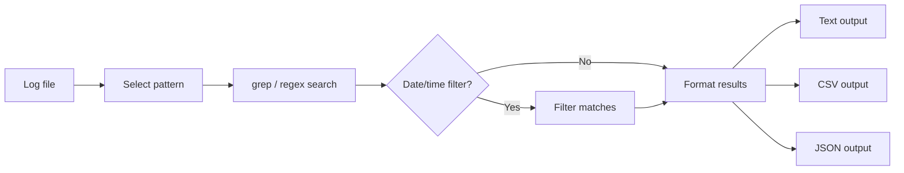

# Bash Log Pattern Analyzer

A Bash utility for searching log files by pattern, date, and time range, then exporting matching entries for further review.

## What It Does

- Searches logs with built-in patterns or a custom regular expression
- Filters matches by date and optional time range
- Supports interactive menu mode and command-line mode
- Numbers matching lines for easier review
- Exports results as plain text, CSV, and JSON
- Provides a simple match-count summary by log level

## Workflow



## Requirements

- Bash
- Standard command-line utilities: `grep`, `awk`, `sed`, `nl`, and `wc`

No external packages are required.

## Usage

Make the script executable if necessary:

```bash
chmod +x logpattern_analyzer.sh
```

### Interactive mode

```bash
./logpattern_analyzer.sh --menu
```

The menu provides presets for errors/warnings, IP addresses, email addresses, usernames, and custom patterns.

### Command-line mode

```bash
./logpattern_analyzer.sh <pattern-type|regex> [date] [start_time] [end_time] [logfile]
```

Example:

```bash
./logpattern_analyzer.sh error 2024-01-15 10:00:00 12:00:00 auth.log
```

If no log file is supplied, the script uses its configured default filename.

## Pattern Types

| Type | Purpose |
|---|---|
| `error` | Matches error, warning, or critical entries |
| `ip` | Searches for IPv4-style addresses |
| `email` | Searches for email-address patterns |
| `user` | Searches for `User <username>` patterns |
| Custom | Any other value is treated as a regular expression |

## Output

The script creates three local output files:

- `matches.log` — numbered matching lines
- `matches.csv` — Line, Date, Time, Level, and Message columns
- `matches.json` — the same information in structured JSON

These generated files are ignored by the repository's `.gitignore`.

## Security / Investigation Context

The tool is useful for basic log triage and demonstrates how command-line text processing can support security investigations. It is intentionally lightweight and does not replace SIEM platforms or dedicated log-analysis tools.

## Limitations

- Log parsing depends on the expected date/time and field layout.
- The built-in patterns are simple matching rules, not full log parsers.
- Time filtering assumes the relevant time is in the expected position in each log line.
- Regex input should be tested carefully against the target log format.

## Skills Demonstrated

- Bash scripting
- Regular expressions
- `grep`, `awk`, `sed`, and other Unix text-processing tools
- Log filtering and triage
- CSV/JSON formatting
- Command-line interface design
