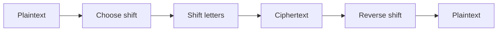

# Caesar Cipher

A small Python implementation of the **Caesar cipher** for learning basic cryptography concepts.

## What It Does

- Encrypts text using a shift value
- Decrypts previously shifted text
- Tries all possible shifts with a brute-force mode
- Preserves spaces, numbers, punctuation, and letter case

## Example

```text
Caesar Cipher
1. Encrypt a message
2. Decrypt a message
3. Brute-force a message

Enter your choice (1/2/3): 1
Enter the message: Hello World
Enter the shift key (1-25): 3
Resulting message: Khoor Zruog
```

## Run

Requires Python 3.

```bash
cd python/1-caesar-cipher
python caesar_cipher.py
```

## How It Works



In brute-force mode, the program tests every possible Caesar shift and prints the resulting text so the weakness of a small key space is easy to observe.

## Security Note

The Caesar cipher is **not secure encryption**. It is included as a learning exercise to demonstrate substitution ciphers, key shifts, and why small key spaces are vulnerable to brute-force attacks.
