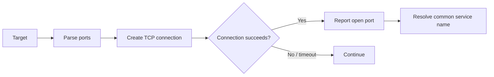

# Python TCP Port Scanner

A beginner-friendly TCP port scanner written in Python using only the standard library.

It checks TCP ports on a target and reports reachable/open ports with common service names when available.

> Use this tool only against systems you own or have explicit permission to test.

## Features

- Scan individual TCP ports
- Scan comma-separated ports
- Scan port ranges
- Scan all TCP ports (`1-65535`)
- Show common service names
- Configurable connection timeout
- Supports IP addresses and hostnames
- Interactive mode
- Command-line mode
- No third-party Python packages required

## Requirements

- Python 3.8+
- Standard library only

## Run

```bash
cd python/6-port-scanner
python port-scanner.py --help
```

### Examples

Scan selected ports:

```bash
python port-scanner.py 192.168.1.10 -p 22,80,443
```

Scan a range:

```bash
python port-scanner.py 192.168.1.10 -p 1-1024
```

Scan all TCP ports:

```bash
python port-scanner.py 192.168.1.10 -p all
```

The actual script name is **`port-scanner.py`**; use that filename when running the tool.

## Workflow



## Security Context

Port scanning is a reconnaissance technique commonly used during security assessments. The results only describe what the scanner can observe from its current network position; filtering, firewalls, rate limiting, and service configuration can affect the result.

This is a learning-focused scanner, not a replacement for mature network-scanning platforms.
