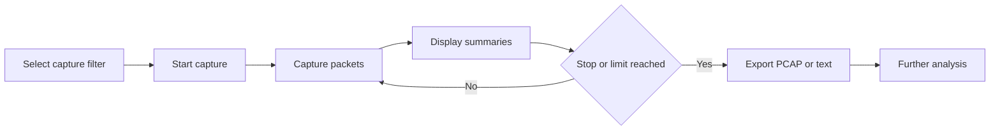

# GUI Packet Sniffer

A Python/Tkinter packet-capture tool for learning how network traffic can be collected, filtered, reviewed, and exported for later analysis.

> **Authorized use only:** Packet capture may expose sensitive network data. Use this tool only on networks and systems you own or are explicitly authorized to analyze.

## Features

- Live packet capture
- TCP, UDP, ICMP, or unfiltered capture modes
- Configurable packet limit
- Start/stop controls
- Live packet summaries in the GUI
- PCAP export for further analysis in Wireshark-compatible tools
- Text-summary export
- Background capture thread to keep the GUI responsive
- Basic privilege and error handling

## Workflow



## Requirements

- Python 3
- `scapy`
- `tkinter` (usually included with Python)
- Administrator/root privileges may be required for packet capture

Install the Python dependency:

```bash
pip install -r requirements.txt
```

## Run

**Windows:** Open a terminal with Administrator privileges, then run:

```bash
python packet_sniffer_gui.py
```

**Linux/macOS:**

```bash
sudo python packet_sniffer_gui.py
```

## Capture Filters

| Mode | Traffic captured |
|---|---|
| All | Packets without a protocol-specific filter |
| TCP | TCP traffic |
| UDP | UDP traffic |
| ICMP | ICMP traffic |

A packet limit of `0` means the capture continues until it is manually stopped.

## Output

Captured traffic can be exported as:

- **PCAP (`.pcap`)** — packet data for later inspection in compatible analysis tools.
- **Text summary (`.txt`)** — one human-readable packet summary per line.

Example summary output:

```text
Ether / IP / TCP 192.168.1.100:54321 > 8.8.8.8:443 S
Ether / IP / TCP 8.8.8.8:443 > 192.168.1.100:54321 SA
```

## Limitations

This is a learning-focused packet capture tool. Capture results depend on the operating system, privileges, active interface, and traffic visible from the capture point. It is not intended to replace mature network-analysis tools.

## Skills Demonstrated

- Python GUI development with Tkinter
- Network packet capture with Scapy
- TCP/UDP/ICMP filtering concepts
- Threading for responsive applications
- PCAP handling and export
- Basic network traffic inspection

## Security Notes

Captured packets may contain sensitive information. Store exports carefully and avoid collecting or sharing traffic without authorization.
