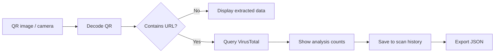

# QR Code Security Scanner

A Python GUI tool that decodes QR codes and checks extracted URLs with **VirusTotal** for reputation information.

The project combines QR-code analysis, URL handling, API integration, a desktop interface, scan history, and JSON export in one practical security workflow.

> **Important:** VirusTotal results are reputation/detection data, not a guarantee that a URL is safe. Do not open a suspicious URL simply because it receives a low or zero detection count.

## Workflow



## Features

- Live QR-code scanning with a webcam
- QR-code scanning from image files
- URL reputation lookup through VirusTotal
- Malicious, suspicious, harmless, and undetected counts
- Scan history
- JSON result export
- Tkinter GUI
- Background processing for longer operations

## Requirements

- Python 3.6+
- Webcam for live scanning (optional)
- VirusTotal API key for URL lookups
- `opencv-python`
- `pyzbar`
- `Pillow`
- `requests`
- `tkinter`

Install the Python packages listed by the project:

```bash
pip install -r requirements.txt
```

## Run

```bash
python qr_virustotal_scanner.py
```

For URL lookups, provide your VirusTotal API key through the application's supported configuration/input method. **Never commit an API key to Git.**

## Supported QR Data

| Data | Handling |
|---|---|
| HTTP/HTTPS URL | Decoded and eligible for VirusTotal lookup |
| IP address | Extracted; handling depends on the application's URL logic |
| Plain text | Displayed without a VirusTotal URL lookup |
| Contact information | Extracted as QR data |
| Wi-Fi data | Extracted as QR data; not treated as a URL automatically |

## Understanding Results

The application displays VirusTotal analysis categories such as **malicious**, **suspicious**, **harmless**, and **undetected**.

A zero malicious count does **not** prove that a URL is safe. Detection engines can disagree, newly created URLs may have little reputation data, and a service cannot determine every possible threat from reputation alone.

## Export

Scan results can be exported as JSON for later review or documentation. Treat exported results as security data and avoid publishing sensitive URLs or other private information.

## Security Considerations

- Never hard-code or commit API keys.
- Be careful when scanning private or sensitive URLs because submitting them to an external reputation service may disclose information to that service.
- Do not automatically open extracted URLs.
- VirusTotal results should support investigation, not replace manual verification.

## Limitations

- Requires external VirusTotal access for reputation lookups.
- API rate limits may restrict repeated scans.
- QR decoding quality depends on camera/image quality.
- A reputation result is not a definitive malware or phishing verdict.
- Network failures or API errors can prevent a lookup from completing.

## Security Context

QR codes are increasingly used to hide destination URLs behind a simple visual interaction. This project demonstrates a safer analysis workflow: **decode first, inspect the destination, obtain reputation information, then make an informed decision rather than blindly opening the link.**
